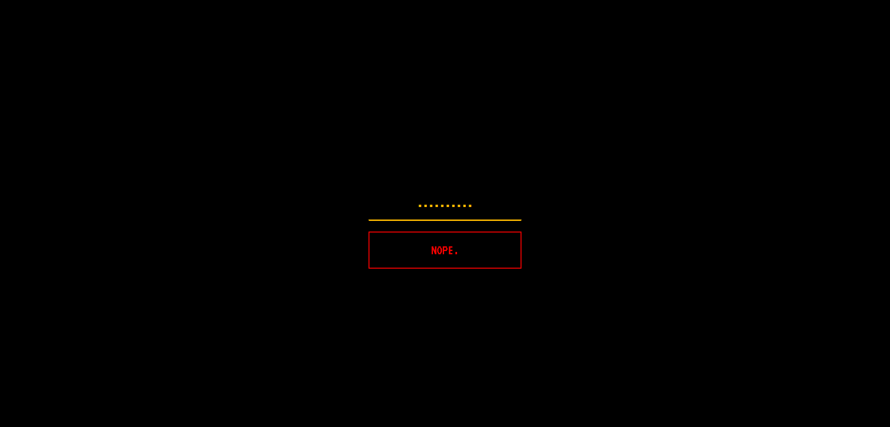
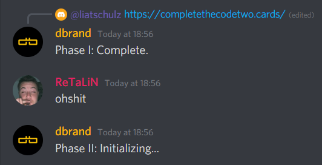

# CTC2 Phase II

This repo shows the current status of phase II for the dbrand Complete the Code 2 challenge.

[Join the madness and complete the code](https://discord.gg/dbrand)

## Current solve status
**Unsolved**

The website https://completethecodetwo.cards/ was discovered on May, 26 2021 as part of phase I.

Thanks to @Vcubed in the dbrand Discord they have set up a [Google Sheets](https://docs.google.com/spreadsheets/d/1ubfE2XXKmXK1Uws72nwHLYBd_mEdxlCOOoOuhlWRCD0/edit) using a Google Apps Script to track and validate our inputs, but please, don't shit inside it. 

## Information collected so far

The site only consists of a text box with a placeholder of `???`.

The site accepts any text input, which it then sends that via a POST request to https://completethecodetwo.cards/pw. If the input if wrong it'll return a "Nope." (403), if the input is correct it will most likely return a 200 or 3XX.

Our end goal is to find the input that won't return a 403.

Additionally, the files used by the website can be found [here](https://github.com/Complete-the-Code/ctc2-phase-2/tree/master/page-files/)

## What is this? (Part II)

On May 26, 2021, some dipshit in the dbrand Discord server (@liatschulz) found the website https://completethecodetwo.cards by using a brain. We have confirmed that the site was created by dbrand using WHOIS records. dbrand has since confirmed that Phase I has been completed and that Phase II has now been started. You can view the message [here](https://discord.com/channels/520021794380447745/832309320934621234/847171349113471046) or see a picture [here](#proof-1)

To view the things we did in phase I click [here](http://phase1.completethecode.com/)

We have a bunch of dipshits on Discord that have been trying to figure out what the password to the website is.

[Join us.](https://discord.gg/dbrand)

---

### Proof 1

